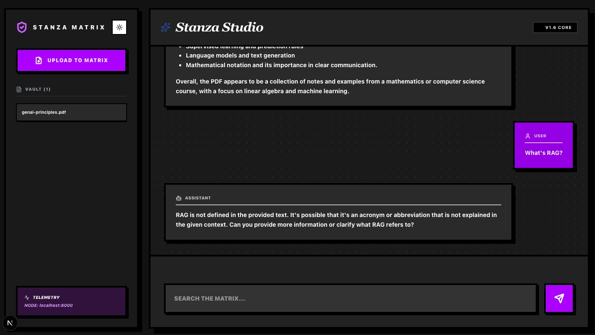
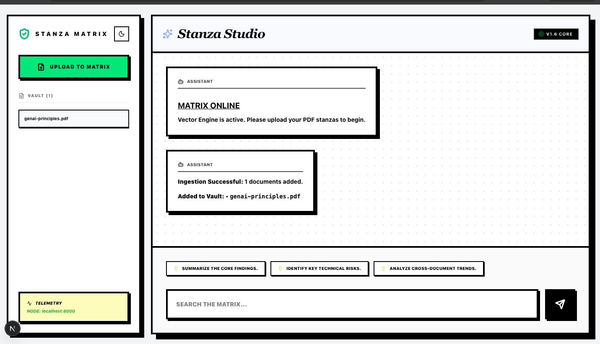
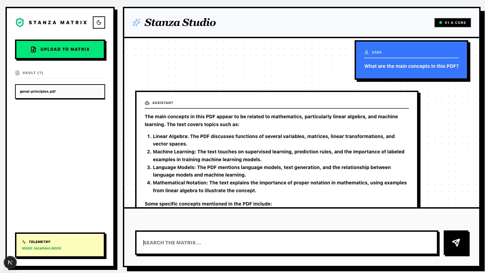

# 🔳 RAG Stanza Engine (V1.6)

> **A high-performance Neural Archive & Retrieval-Augmented Generation (RAG) engine — built for precision, speed, and a bold Neo-Brutalist aesthetic.**



---

# ⚡ Architecture Overview

The **Stanza Engine** is a **decoupled, production-ready RAG pipeline** designed to eliminate latency and ensure reliability by separating ingestion from query-time processing.

### 🧩 Stack

| Layer           | Technology                            |
| --------------- | ------------------------------------- |
| Frontend        | Next.js 15 (App Router), Tailwind CSS |
| Backend         | FastAPI (Python 3.10+)                |
| Vector DB       | Qdrant                                |
| Background Jobs | Inngest                               |
| Embeddings      | BGE-Small-EN (ONNX, local)            |

---

# 🛠️ Core Features

### 🚀 Asynchronous Ingestion

* PDFs are **queued**, not processed instantly
* Background processing via **Inngest**
* Zero UI blocking

### 🧠 Local Embedding Intelligence

* Uses quantized `bge-small-en-v1.5`
* Runs locally via ONNX
* Reduces cost and latency

### 🔍 Stanza Retrieval

* Cosine similarity search
* Semantic matching (not just keywords)

### 🎨 Neo-Brutalist UI

* 4px borders
* Hard shadows (`#000000`)
* Monospace-first design

---

# 📸 Product Walkthrough

## 📤 File Upload (Ingestion)



* Upload a PDF document
* Automatically queued for background processing
* No waiting — system stays responsive

---

## ❓ Asking Questions (Query Interface)



* Ask natural language questions
* Query is embedded locally
* Relevant chunks retrieved from Qdrant

---

## 💬 AI Response (RAG Output)


* Context-aware answers generated from your documents
* Uses retrieved "stanzas" for grounded responses
* Smart context trimming for token efficiency

---

## 🌞 Light Mode UI


* Full Neo-Brutalist design preserved
* Clean high-contrast light theme
* Readable and minimal

---

## 🌗 Dark vs Light Mode

| Dark Mode                        | Light Mode                             |
| -------------------------------- | -------------------------------------- |
|  |  |

---

# 🏗️ Workflow & Data Lifecycle

## 1️⃣ Ingestion & Event Dispatch

* User uploads PDF
* Backend stores file
* Emits `stanza.ingest` event → Inngest
* Processing runs asynchronously

---

## 2️⃣ Neural Processing (ONNX)

### ✂️ Chunking

* Recursive character splitting
* Preserves semantic meaning

### 🔢 Embedding

* Converts text into **384-dimensional vectors**

---

## 3️⃣ Vector Storage (Qdrant)

* Collection: `stanzas_archive`
* Distance metric: **Cosine Similarity**
* Enables semantic retrieval

---

# 📊 Data Schema

## 🧬 Vector Payload (Qdrant)

| Field     | Type       | Description     |
| --------- | ---------- | --------------- |
| `id`      | UUID       | Unique chunk ID |
| `vector`  | Float[384] | Embedding       |
| `content` | String     | Raw text chunk  |
| `source`  | String     | File origin     |
| `page`    | Integer    | Page reference  |

---

# 🔌 API Reference

| Endpoint           | Description                  |
| ------------------ | ---------------------------- |
| `POST /api/ingest` | Start ingestion pipeline     |
| `POST /api/query`  | Retrieve + generate response |

---

# 🚀 Local Setup

## 1️⃣ Start Qdrant

```bash
docker run -p 6333:6333 qdrant/qdrant
```

---

## 2️⃣ Environment Variables

Create `.env` inside `backend/`:

```env
QDRANT_URL=http://localhost:6333
QDRANT_API_KEY=your_optional_cloud_key
OPENAI_API_KEY=your_key_here
INNGEST_EVENT_KEY=your_key_here
```

---

## 3️⃣ Backend (FastAPI)

```bash
cd backend
python -m venv .venv
source .venv/bin/activate
pip install -r requirements.txt
uvicorn main:app --reload
```

---

## 4️⃣ Inngest Dev Server

```bash
npx inngest-cli@latest dev -u http://127.0.0.1:8000/api/inngest
```

---

## 5️⃣ Frontend (Next.js)

```bash
cd frontend
npm install
npm run dev
```

---

# 📈 Performance Optimizations

### ⚡ ONNX Quantization

* ~3× faster than PyTorch
* Lower memory usage

### 🧠 Context Window Management

* Token-aware pruning
* Keeps only most relevant chunks
* Prevents LLM overflow

---

# ✒️ Design Philosophy

Stanza embraces **Neo-Brutalism**, rejecting soft UI trends.

### 🧱 Core Principles

**Borders**

```css
border-4 border-black
```

**Shadows**

```css
shadow-[8px_8px_0px_0px_rgba(0,0,0,1)]
```

**Palette**

```
#FFFFFF (White)
#000000 (Black)
```

---

# 🤝 Contributing

```bash
# 1. Fork repository
# 2. Create feature branch
git checkout -b feature/YourFeature

# 3. Commit changes
git commit -m "Add feature"

# 4. Push branch
git push origin feature/YourFeature
```

Open a Pull Request 🚀

---

# 👨‍💻 Author

**Muhammad Magdy**

---

# 🧠 Summary

Stanza Engine is built to:

* ⚡ Eliminate ingestion bottlenecks
* 🔍 Enable fast semantic retrieval
* 🧠 Run efficiently with local embeddings
* 🎨 Deliver a bold, opinionated UI

---
